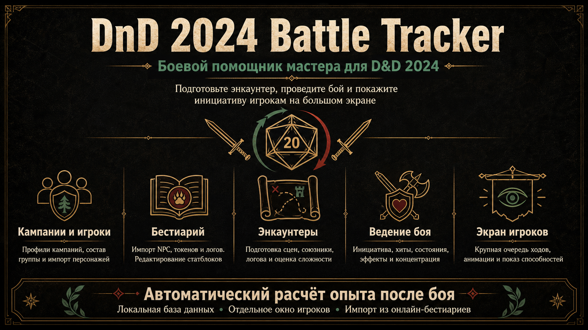

# DnD 2024 Battle Tracker

Desktop-приложение для мастера DnD 2024: кампании, игроки, энкаунтеры, импорт NPC, инициатива, хиты, состояния, логова и отдельный экран игроков.

## Возможности

- Профили кампаний с отдельными списками игроков, NPC и энкаунтеров.
- Бестиарий с импортом NPC из Ruleholder, next.dnd.su и TTG Club.
- Локальное редактирование статблоков: КД, хиты, скорости, характеристики, навыки, сопротивления, иммунитеты, КО/опыт, действия, особенности, изображения и токены.
- Импорт и отображение логов существ, включая эффекты логова.
- Подсказки заклинаний по ссылкам внутри способностей и действий.
- Подготовка энкаунтеров заранее: игроки, NPC-группы, индивидуальная или групповая инициатива, преимущество на инициативу, ручная перезапись инициативы, случайные хиты по кубам.
- Боевой порядок с раундами и ходами, переходом вперёд/назад, завершением раунда и горячими клавишами.
- Управление обычными и временными хитами, лечением, уроном, КД и максимумом хитов.
- Состояния и эффекты с иконками и всплывающими правилами.
- Концентрация, таймеры эффектов, статусы `Побеждён` и `Сбежал`.
- Отдельное read-only окно игроков с крупным масштабом, токенами, публичной инициативой и карточками способностей.
- Завершение боя с настройками начисления опыта и показом результата игрокам.
- Локальная SQLite-база в директории данных Electron.

## Технологии

- Electron
- React
- TypeScript
- Vite / electron-vite
- SQLite / better-sqlite3
- Tailwind CSS
- lucide-react
- @dice-roller/rpg-dice-roller
- cheerio

## Установка

Требования:

- Node.js LTS
- npm
- Windows 10/11

```powershell
npm.cmd install
```

Если PowerShell блокирует `npm`, используйте `npm.cmd`, а не `npm`.

## Запуск dev-версии

```powershell
npm.cmd run dev
```

## Проверки

```powershell
npm.cmd run check
```

Отдельно доступны `typecheck`, `lint`, `format:check`, `test`, `test:coverage` и `test:e2e`. Архитектура проекта описана в [ARCHITECTURE.md](ARCHITECTURE.md), правила внесения изменений — в [CONTRIBUTING.md](CONTRIBUTING.md).

## Сборка

```powershell
npm.cmd run build
npm.cmd run dist
```

Готовый installer создаётся в папке `release/`.

Windows-сборка использует NSIS wizard: установщик показывает шаги установки, позволяет выбрать папку, создаёт ярлык на рабочем столе и пункт в меню Пуск.

`npm.cmd run dist` использует `scripts/dist.ps1`. Скрипт готовит локальный cache Electron Builder в `.electron-builder-cache/` и обходит Windows-ошибку `Cannot create symbolic link` при распаковке `winCodeSign-2.6.0.7z`. Если сборщик всё равно не может скачать служебные NSIS-файлы, повторите команду с включённым интернетом.

При удалении через Windows uninstaller спросит, удалять ли локальные данные приложения. Если выбрать удаление, будут очищены кампании, энкаунтеры, игроки, импортированные NPC и локальная SQLite-база из папки данных Electron. При обновлении версии данные не удаляются.

## Обновления из приложения

В настройках есть кнопка проверки обновлений. Она использует GitHub Releases репозитория `MJl2517/DnD2024-Battle-Tracker`.

Для релиза нужно поднять версию в `package.json`, собрать и опубликовать installer вместе с `latest.yml`:

```powershell
npm.cmd run dist:publish
```

Для публикации через `electron-builder` потребуется GitHub token с правом создавать релизы. В dev-режиме проверка обновлений показывает справочное сообщение, потому что автообновление работает только в установленной сборке приложения.

### Публикация GitHub Release

После коммита можно собрать installer и опубликовать релиз отдельным скриптом:

```powershell
npm.cmd version patch
npm.cmd run git:push -- "Release 0.1.1"
npm.cmd run dist
npm.cmd run release:publish
```

Скрипт `release:publish`:

- берёт версию из `package.json`;
- проверяет, что рабочее дерево закоммичено;
- проверяет наличие `release\DnD-2024-Battle-Tracker-Setup-<version>.exe`, `.blockmap` и `latest.yml`;
- создаёт тег `v<version>`;
- пушит ветку и тег;
- создаёт или обновляет GitHub Release;
- загружает installer, blockmap и `latest.yml`.

Можно собрать и опубликовать одним шагом:

```powershell
npm.cmd run release:build-publish
```

Для авторизации установите GitHub CLI и выполните `gh auth login`, либо задайте переменную окружения `GH_TOKEN`/`GITHUB_TOKEN` с правами на создание релизов.

Также есть CMD-обёртка для запуска вручную:

```cmd
scripts\github-release.cmd
```

## GitHub

Репозиторий:

```text
https://github.com/MJl2517/DnD2024-Battle-Tracker.git
```

Для удобства добавлены скрипты:

```powershell
scripts\git-pull.ps1
scripts\git-push.ps1 "Сообщение коммита"
```

И CMD-обёртки:

```cmd
scripts\git-pull.cmd
scripts\git-push.cmd "Сообщение коммита"
```

`git-push` перед коммитом проверяет, что папка `secret/` не отслеживается Git. Если она уже была добавлена вручную, скрипт остановится.

## Что не попадает в репозиторий

`.gitignore` исключает:

- `secret/`
- `.env*`
- `node_modules/`
- `out/`, `release/`, `dist/`
- локальные SQLite-базы
- логи
- локальные ярлыки `.lnk`, `.vbs` и root `.cmd`
- служебные папки `.agents/`, `.codex/`

Публичные иконки состояний, которые нужны приложению в runtime, лежат отдельно в `src/renderer/public/statuses/` и могут попадать в репозиторий.
